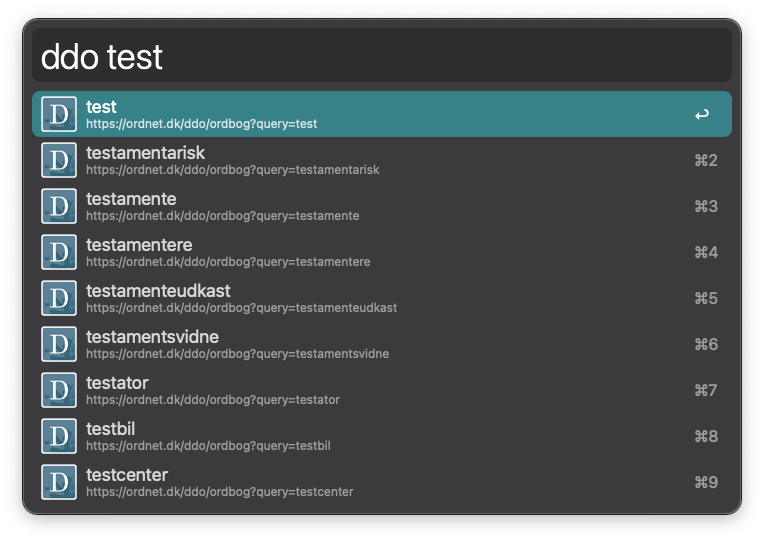

# Den Danske Ordbog Workflow for Alfred 3/4

This workflow gives you in-line access to Den Danske Ordbog, helping you find Danish words in a jiff.

In Alfred simply type `ddo {some word}`, and there you go.

## Installation

Either grab the source code here and do what you want, or just look over here ➡️ and grab the latest release. That's it.

## License

MIT

